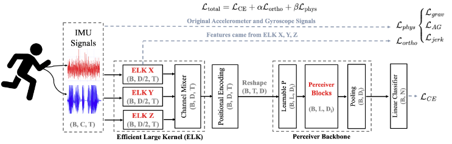

# P2-Perceiver
(paper source) Prototype-Guided Physics-Modulated Perceiver for Human Activity Recognition

<p align="center"></p>

This repository implements the methodology proposed in the paper "Prototype-Guided Physics-Modulated Perceiver for Human Activity Recognition".


## Model Architecture

The P2-Perceiver model is designed for sensor data processing, incorporating structure-aware embeddings and a Perceiver backbone for efficient feature extraction from IMU signals like accelerometers, gyroscopes, and magnetometers. It begins with an **ELK layer that groups sensors by axes or modalities and applies Expanded Large Kernel (ELK) blocks to generate embeddings**, followed by a mixer for fusion. The backbone uses a **Perceiver architecture with time-aware cross-attention and self-attention blocks** to handle variable-length sequences, projecting inputs to latents and processing them through multiple layers. The **overall loss combines cross-entropy for classification with an orthogonal loss on group features to encourage diversity and independence among sensor groups**. Additionally, a **physics-guided loss is incorporated, including gravity-gyro consistency, accelerometer-gyro correlation, and jerk minimization** to enforce physical priors. This design makes the model **robust to noise** by leveraging structured embeddings and physics constraints, ensuring reliable performance in noisy real-world sensor environments.

## Citing this Repository

If you use this code in your research, please cite:

```
@article{P2Perceiver,
  title = {Prototype-Guided Physics-Modulated Perceiver for Human Activity Recognition},
  author={Gyuyeon Lim and Myung-Kyu Yi}
  journal={},
  volume={},
  Issue={},
  pages={},
  year={}
  publisher={}
}
```

## Contact

For questions or issues, please contact:
- Gyuyeon Lim : lky473736@gmail.com

## License

This project is licensed under the MIT License - see the [LICENSE](LICENSE) file for details.
